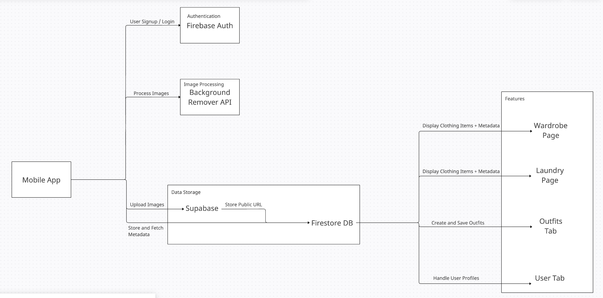

## System Architecture Diagram

The architecture of our Closet Tracker mobile application consists of multiple components that interact with one another to provide a smooth user experience:

###### Mobile App (Frontend)

- Built using React Native with Expo Go
- Handles user interactions such as authentication, uploading clothing images, and outfit creation.
- Communicates with Firebase Authentication, Firestore Database, Supabase Storage, and third-party APIs.

###### Authentication (Firebase Auth)

- Users can sign up and log in using Firebase Authentication.
- Ensures secure access control and session management.

###### Image Processing (Background Remover API)

- When users upload images of their clothing, the Background Remover API processes the images to remove backgrounds.
- The process images are returned to the mobile app for further actions.

###### Data Storage

- Supabase Storage stores images uploaded by users and generates public URLs for stored images. These URLs are later used to retrieve images in the application.
- Firestore Database stores metadata about clothing items (name, type, size, color, wear count, etc.). It also stores outfits created by users and their associated clothing items. Additionally keeps track of user profile details, including profile pictures and descriptions.

###### Features and Data Flow

- Firestore Database is responsible for storing and retrieving and metadata, which is utilized by various features in the application:
  - Wardrobe Page: Fetches and displays clothing items and metadata.
  - Laundry Page: Retrieves clothing items designated for washing.
  - Outfits Tab: Allows users to arrange clothing items on a canvas, resize them, and save outfits.
  - User Tab: Handles user profile updates, including storing and retrieving profile pictures / descriptions.
