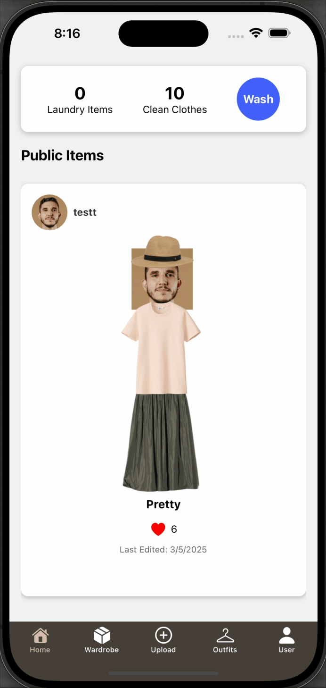

# Closet Tracker User Manual

## Product Purpose

Closet Tracker helps you **keep track of your clothing, plan stylish outfits, and stay on top of laundry**. Whether you want to stay organized, experiment with new outfit combinations, or make sure you're washing your clothes regularly, this app is designed to simplify your wardrobe management. You can upload pictures of your clothing, organize them by category, and track how often you wear each item.

## Getting Started

### Signing Up & Logging In

If you’re new to Closet Tracker, you’ll need to **sign up** with your email and password. Once your account is created, you can start adding clothes to your digital wardrobe. If you already have an account, simply **log in** to access your saved wardrobe, outfits, and laundry history.

## Home Page

The Home Page is where you can **browse outfits shared by other users**. If you see something you like, tap the **heart icon** to let them know you like their style. 

If your laundry is piling up, you can tap the **"Wash All" button** to move all your laundry items back to wardrobe. This shortcut helps when you have just washed all clothing items, and they are ready to use.

## User Page

Your User Page is where you manage your profile. You can **upload and change your profile picture** to personalize your account. Update your **bio or description** to share a little about your style. If you ever need to log out, simply tap **Sign Out** to securely exit the app.

## Upload Page

Adding clothes to your digital wardrobe is easy! 

- You can **upload a clothing item** from your photo gallery or **take a new photo** with your camera.
- The app helps you **remove the background** from the image so your clothing stands out.
- After uploading, you’ll be prompted to **add details** like the clothing’s name, type, brand, size, color, and any extra notes.
- Once you’re happy with the details, hit **Submit**, and your item will be added to your wardrobe.

## Wardrobe Page

The Wardrobe Page is where you can view and organize all of your clothes. 

- If your wardrobe is empty, you’ll see a message encouraging you to add some clothing.
- When you have items in your wardrobe, you can **browse through them and tap on any item** to see the details you've inputted beforehand, as well as an option to edit those details.
- You can **use the multi-select feature** to:
  - Move multiple items to the laundry when they need washing.
  - Edit multiple items at once.
  - Delete clothing you no longer need.
 - If you have a lot of clothing, use the **search and filter options** to quickly find what you need.

### Tracking Wear & Maintenance

- Every time you wear an item, you can **increase its wear count** to track how often you’ve worn it.
- As items get worn out, they will **gradually change color to brown** as a visual reminder that they need washing.
- When an item reaches **five wears**, you’ll get a **reminder message** to wash it.

## Laundry Page

When your clothes need washing, they’ll be stored in the Laundry Page. 

- You can **move individual items back to your wardrobe** once they’re clean.
- Each time you move an item back to your wardrobe, **its wear count will reset to 0**, so you can start fresh.
- If you don’t want to move items one by one, you can use the **"Wash All" button** in home page to instantly clean everything in your laundry.

## Outfits Page

The Outfits Page is where you can **get creative and put together new outfits**. 

- When creating an outfit, you can **select clothing items onto a canvas**, where you can resize and position them however you like.
- If you want to adjust how items are layered, you can **drag them in the layering panel** to change which item appears on top.
- You can also give it a name, add notes, and then **save it**.

### Managing Your Outfits

- Tap on any outfit to see its details.
- If you want to share your outfit with others, you can **make it public** so it appears on the Home Page. If you’d rather keep it private, you can **toggle it back to private mode**.
- If your wardrobe has grown over time, you can **search for outfits by name** to quickly find what you need.

---

Closet Tracker is designed to make managing your wardrobe easy and fun. Whether you're keeping track of your favorite outfits, organizing laundry, or just looking for outfit inspiration, this app helps you stay in control of your style. Happy organizing! 🎉
